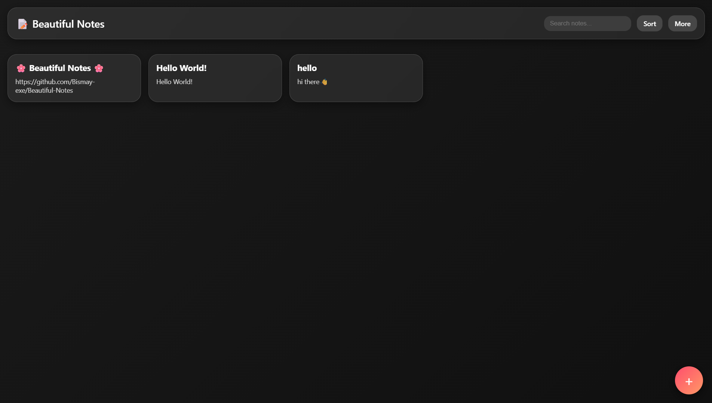
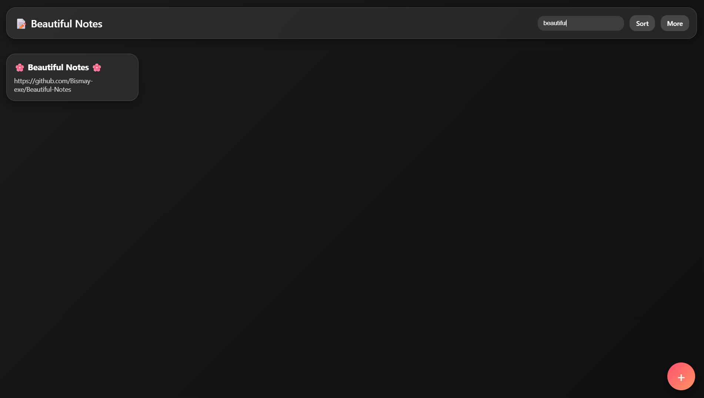
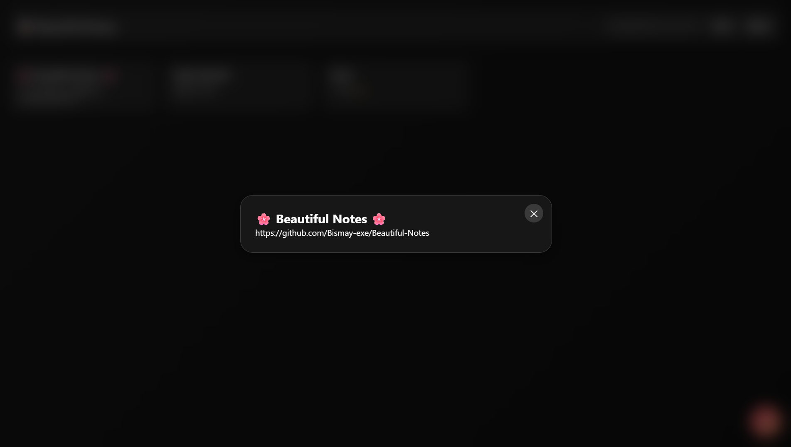
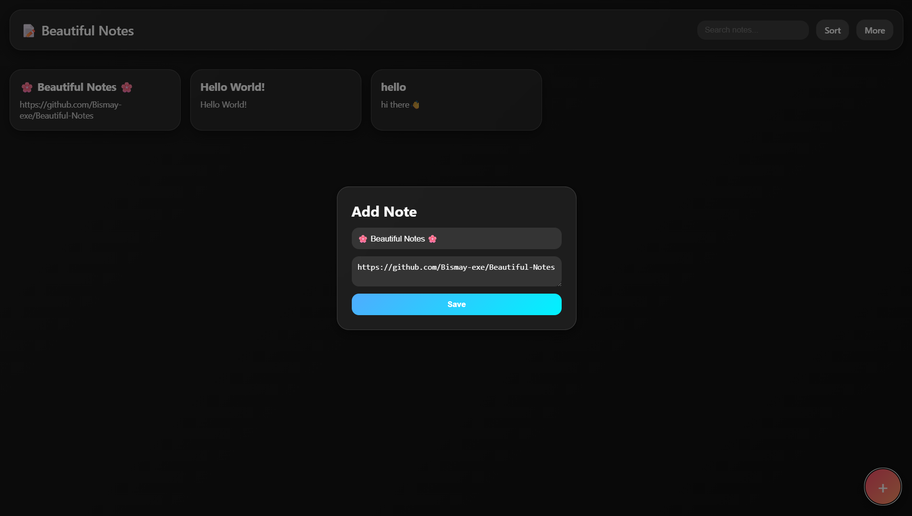

<!-- Banner -->


<p align="center">
  
</p>

<p align="center">
  
  
  
  
  
</p>

---

## 📸 Preview

<p align="center">
  <table>
    <tr>
      <td align="center">
        <br>
        <b>Notes Grid</b>
      </td>
      <td align="center">
        <br>
        <b>Search Notes</b>
      </td>
    </tr>
    <tr>
      <td align="center">
        <br>
        <b>Fullscreen Note</b>
      </td>
      <td align="center">
        <br>
        <b>Add Note</b>
      </td>
    </tr>
  </table>
</p>

A **modern notes app** with **glassmorphism UI**, smooth animations, and built-in features like search, sort, fullscreen, and persistent storage.

---

## ✅ Features at a Glance

<div align="center">

### 📝 Beautiful Notes  
Create and manage unlimited notes  
Minimal, glassy design  

---

### 🔍 Smart Search  
Search notes instantly as you type  
Highlights relevant results  

---

### ↕️ Sort Options  
Sort notes by **Newest**, **Oldest**, or **Title**  
Quick access via dropdown menu  

---

### 🖼️ Fullscreen View  
Open any note in fullscreen mode  
Distraction-free reading  

---

### ➕ Add & Edit  
Easily add notes with title & content  
Modal-based input  

---

### 💾 Persistent Storage  
All notes are stored in **localStorage**  
Your notes stay even after reload  

---

### 🎨 Glassmorphism UI  
Glassy panels with blur effect  
Smooth hover animations  

---

### ⚡ Extra Goodies  
Clear all notes with one click  
Responsive layout (works on all devices)  

</div>

---

## 💡 Tips & Tricks

- 🔍 Use the **search bar** to instantly filter notes.  
- ↕️ Use the **sort dropdown** to rearrange notes (newest, oldest, title).  
- 🖼️ Click a note to open it in **fullscreen mode**.  
- ➕ Use the floating **add button** to create a new note anytime.  
- 🗑️ Use the **Clear All** option under *More* to delete everything.  

---

## 🛠️ Tech Stack  

<p align="center">
  
</p>

---

## 📊 GitHub Stats (Project)

<p align="center">
  
</p>

---

## ASCII Banner

<!--ascii-start-->
Font: `block`
Message: `Beautiful Notes 📝`
```text
   _____                .__                  .__              .__   
  /     \   ____   ____ |  |__ _____    ____ |__| ____ _____  |  |  
 /  \ /  \_/ __ \_/ ___\|  |  \\__  \  /    \|  |/ ___\\__  \ |  |  
/    Y    \  ___/\  \___|   Y  \/ __ \|   |  \  \  \___ / __ \|  |__
\____|__  /\___  >\___  >___|  (____  /___|  /__|\___  >____  /____/
        \/     \/     \/     \/     \/     \/        \/     \/      
 _______          __                                                
 \      \   _____/  |_  ____   ______                               
 /   |   \ /  _ \   __\/ __ \ /  ___/                               
/    |    (  <_> )  | \  ___/ \___ \                                
\____|__  /\____/|__|  \___  >____  >                               
        \/                 \/     \/
```
<!--ascii-end-->

---

## 🌐 Connect with me

<p align="center">
  <a href="https://github.com/Bismay-exe" target="_blank">
    
  </a>

  <a href="https://instagram.com/bismay.exe" target="_blank">
    
  </a>

  <a href="https://t.me/bismay_exe" target="_blank">
    
  </a>

  <a href="https://discord.com" target="_blank">
    
  </a>
</p>

<p align="center">
  <a href="https://youtube.com" target="_blank">
    
  </a>

  <a href="https://linkedin.com" target="_blank">
    
  </a>

  <a href="https://threads.net/@bismay.exe" target="_blank">
    
  </a>

  <a href="https://t.me/BismaysInventory" target="_blank">
    
  </a>
</p>


---
